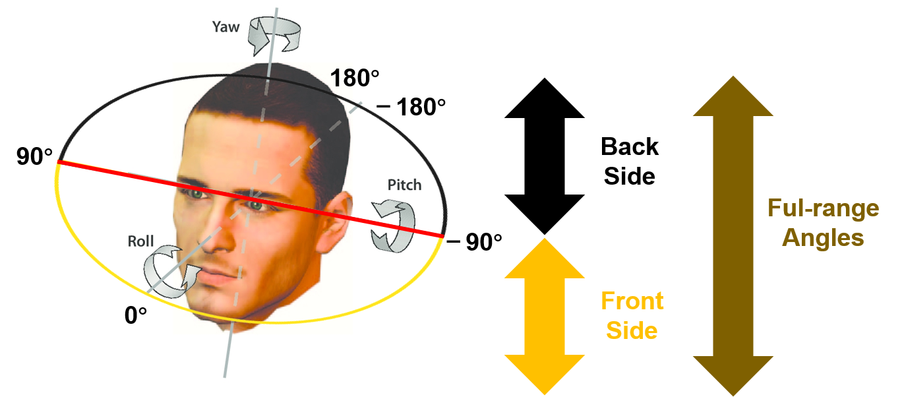
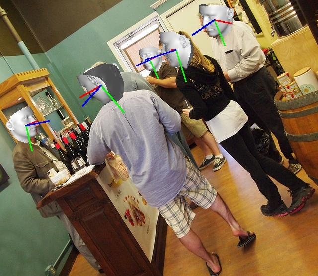
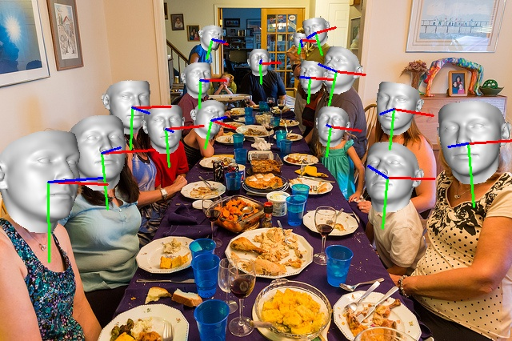
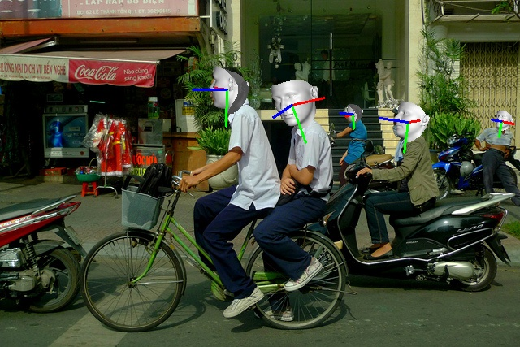
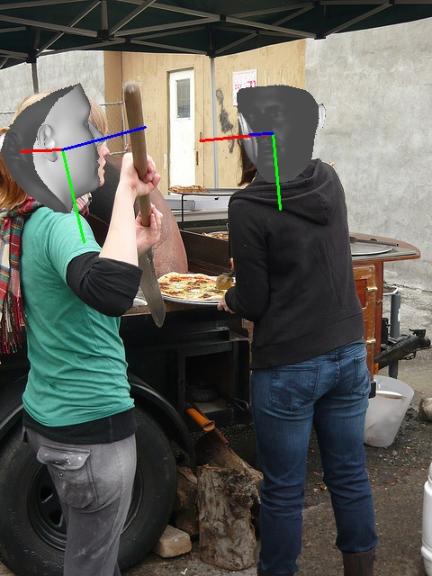
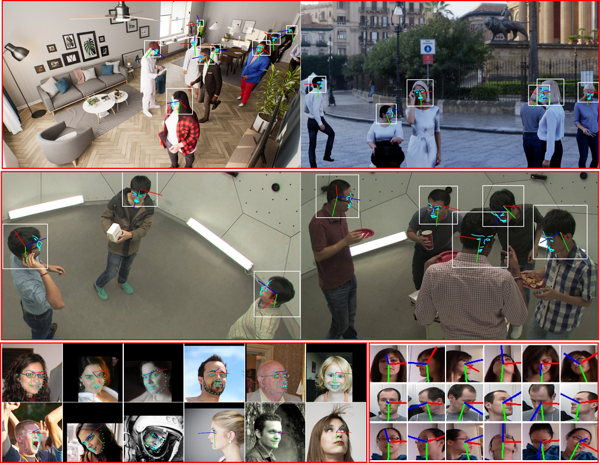
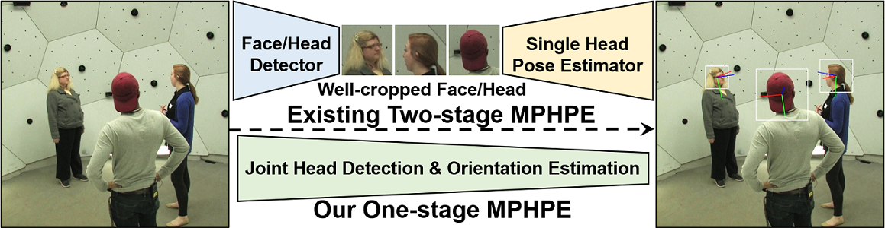

# DirectMHP
Codes for my paper "[DirectMHP: Direct 2D Multi-Person Head Pose Estimation with Full-range Angles](https://arxiv.org/abs/2302.01110)"

* :white_check_mark: [**2024-04-25**] We have released our [SemiUHPE](https://hnuzhy.github.io/projects/SemiUHPE/) for `Unconstrained Head Pose Estimation`. By combining with our previous `Body-Head Joint Detector` [BPJDet](https://hnuzhy.github.io/projects/BPJDet/), SemiUHPE is much more superior than this project DirectMHP.
* :white_check_mark: [**2024-01-18**] We have released our [Project Website](https://hnuzhy.github.io/projects/DirectMHP/) containing video/image demos. Refer it for a fast glance.
* :white_check_mark: [**2023-03-24**] We uploaded our DirectMHP-S/M models (for single HPE task) pretrained on weakly labeled [[WiderFace](https://github.com/vitoralbiero/img2pose/blob/main/README.md#prepare-wider-face-dataset)] and finetuning on resorted [[300W-LP](#single-hpe-datasets)] in [Hugging Face -- Single HPE](https://huggingface.co/HoyerChou/DirectMHP#single-hpe-task-pretrained-on-widerface-and-finetuning-on-300w-lp).
* :white_check_mark: [**2023-03-23**] We added [[Licenses](#licenses)] for your need if you want to use our work in your business project.
* :white_check_mark: [**2023-03-22**] We uploaded the revised [[6DRepNet](./exps/sixdrepnet.zip)] project for the single HPE training with full-range angles. Please refer its [[original code](https://github.com/thohemp/6DRepNet)] and [[our re-training steps](#6drepnet-full-range)] if you want to reproduce.
* :white_check_mark: [**2023-03-15**] We uploaded our DirectMHP-S/M pretrained models trained on [[CMU-HPE](#cmu-hpe-dataset)] and [[AGORA-HPE](#agora-hpe-dataset)] in [Hugging Face](https://huggingface.co/HoyerChou/DirectMHP). Please follow the [[Inference](#inference)] section to test on your own images/videos.
* :white_check_mark: [**2023-03-07**] We have collected many SOTA HPE methods in our [[face_head_related](https://github.com/hnuzhy/CV_DL_Gather/blob/master/face_head_related/readme.md#-Head-Pose-Estimation)] blog. Feel free to refer it.


<table>
<tr>
<td></td>
<td></td> 
</tr>
</table>

## Paper Abstract
> Existing head pose estimation (HPE) mainly focuses on single person with pre-detected frontal heads, which limits their applications in real complex scenarios with multi-persons. We argue that these single HPE methods are fragile and inefficient for Multi-Person Head Pose Estimation (MPHPE) since they rely on the separately trained face detector that cannot generalize well to full viewpoints, especially for heads with invisible face areas. In this paper, we focus on the full-range MPHPE problem, and propose a direct end-to-end simple baseline named DirectMHP. Due to the lack of datasets applicable to the full-range MPHPE, we firstly construct two benchmarks by extracting ground-truth labels for head detection and head orientation from public datasets AGORA and CMU Panoptic. They are rather challenging for having many truncated, occluded, tiny and unevenly illuminated human heads. Then, we design a novel end-to-end trainable one-stage network architecture by joint regressing locations and orientations of multi-head to address the MPHPE problem. Specifically, we regard pose as an auxiliary attribute of the head, and append it after the traditional object prediction. Arbitrary pose representation such as Euler angles is acceptable by this flexible design. Then, we jointly optimize these two tasks by sharing features and utilizing appropriate multiple losses. In this way, our method can implicitly benefit from more surroundings to improve HPE accuracy while maintaining head detection performance. We present comprehensive comparisons with state-of-the-art single HPE methods on public benchmarks, as well as superior baseline results on our constructed MPHPE datasets.


## Table of contents
<!--ts-->
- [Illustrations](#illustrations)
- [Installation](#installation)
- [Dataset Preparing](#dataset-preparing)
  * [Single HPE datasets](#single-hpe-datasets)
  * [MPHPE datasets](#mphpe-datasets)
    + [AGORA-HPE dataset](#agora-hpe-dataset)
    + [CMU-HPE dataset](#cmu-hpe-dataset)
- [Reproduction of SOTA methods](#reproduction-of-sota-methods)
  * [Directly testing without retraining](#directly-testing-without-retraining)
  * [Retraining and testing](#retraining-and-testing)
    + [FSA-Net (narrow-range)](#fsa-net-narrow-range)
    + [6DRepNet (full-range)](#6drepnet-full-range) 
- [Training and Testing](#training-and-testing)
  * [Configs](#configs)
  * [MPHPE task](#mphpe-task)
    + [On AGORA-HPE](#on-agora-hpe)
    + [On CMU-HPE](#on-cmu-hpe)
  * [Single HPE task](#single-hpe-task)
- [Inference](#inference)
- [References](#references)
- [Licenses](#licenses)
- [Citation](#citation)
<!--te-->


## Illustrations

* **Full-range angles** 


* **Results visualization**
<table>
<tr>
<td></td>
<td></td> 
<td></td> 
<td></td> 
</tr>
<tr>
<td></td>
<td></td> 
<td></td> 
<td></td> 
</tr>
</table>

* **Fig. 1.** Example images of two constructed challenging datasets: AGORA-HPE (*top row*) and CMU-HPE (*middle row*), and two widely used single HPE datasets: 300W-LP & AFLW2000 (*left-down*) and BIWI (*right-down*).


* **Fig. 2.** The pipeline illustration of existing HPE methods, which are all based on two separate stages, and our proposed one-stage MPHPE.



## Installation

* **Environment:** Anaconda, Python3.8, PyTorch1.10.0(CUDA11.2), wandb
```bash
$ git clone https://github.com/hnuzhy/DirectMHP.git
$ pip install -r requirements.txt -i https://pypi.tuna.tsinghua.edu.cn/simple

# Codes are only evaluated on GTX3090 + CUDA11.2 + PyTorch1.10.0.
$ pip3 install torch==1.10.0+cu111 torchvision==0.11.1+cu111 torchaudio==0.10.0+cu111 \
  -f https://download.pytorch.org/whl/cu111/torch_stable.html
```

* **Sim3DR:** Install the renderer, which is used to visualize predictions.
```bash
$ cd Sim3DR
$ sh build_sim3dr.sh
```

## Dataset Preparing

### Single HPE datasets
* **Only training on 300W-LP:**
  * Following the `Protocol 1` in [FSA-Net](https://github.com/shamangary/FSA-Net). Training: `300W-LP`. Testing: `AFLW2000` or `BIWI`. Original dataset links: [[300W-LP, AFLW2000](http://www.cbsr.ia.ac.cn/users/xiangyuzhu/projects/3DDFA/main.htm)], [[BIWI](https://data.vision.ee.ethz.ch/cvl/gfanelli/head_pose/head_forest.html)]. The data pre-processing steps can be found in [FSA-Net Codes](https://github.com/shamangary/FSA-Net/blob/master/README.md#1-data-pre-processing).
  * Then, convert these data (300W-LP, AFLW2000 and BIWI) into `YOLOv5+COCO` format for our project needing following scripts below. They may need our resorted json files as inputs: [train_300W_LP.json](https://huggingface.co/HoyerChou/DirectMHP/blob/main/train_300W_LP.json), [val_AFLW2000.json](https://huggingface.co/HoyerChou/DirectMHP/blob/main/val_AFLW2000.json) and [BIWI_test.json](https://huggingface.co/HoyerChou/DirectMHP/blob/main/BIWI_test.json). The corresponding resorted images used in our DirectMHP can be downloaded [300W-LP.zip](https://huggingface.co/HoyerChou/DirectMHP/blob/main/300W_LP.zip), [AFLW2000.zip](https://huggingface.co/HoyerChou/DirectMHP/blob/main/AFLW2000.zip) and [BIWI_test.zip](https://huggingface.co/HoyerChou/DirectMHP/blob/main/BIWI_test.zip).
  ```bash
  # following the COCO API, run ./exps/convert_coco_style_300wlp_aflw2000.py
  # getting train_300W_LP_coco_style.json, val_AFLW2000_coco_style.json and images folder.
  $ cd /path/to/project/DirectMHP
  $ python exps/convert_coco_style_300wlp_aflw2000.py

  # preparing yolov5-style labels, remember config the data/300w_lp_aflw2000.yaml file
  $ rm -rf /path/to/dataset/300W-LP/yolov5_labels
  $ python utils/labels.py --data data/300w_lp_aflw2000.yaml

  # if testing on BIWI, remember config the data/300w_lp_biwi.yaml file
  $ cd /path/to/project/DirectMHP
  $ python ./exps/convert_coco_style_300wlp_biwi.py
  $ rm -rf /path/to/dataset/300W-LP/yolov5_labels
  $ python utils/labels.py --data data/300w_lp_biwi.yaml
  ```
    
* **Pretraining on WiderFace and finetuning on 300W-LP:**
  * Following the weakly supervised training in [img2pose](https://github.com/vitoralbiero/img2pose). Pretraining: `WiderFace`. Finetuning: `300W-LP`. Testing: `AFLW2000` or `BIWI`. Original dataset links: [[WiderFace](http://shuoyang1213.me/WIDERFACE/)]. The data pre-processing steps can be found in [Prepare WIDER FACE dataset](https://github.com/vitoralbiero/img2pose/blob/main/README.md#prepare-wider-face-dataset).
  * Then, convert these data (WiderFace) into `YOLOv5+COCO` format for our project needing following scripts below.
  ```bash
  # following the COCO API, run ./exps/convert_coco_style_img2pose.py
  # getting coco_style_img2pose_train.json, coco_style_img2pose_val.json and images folder.
  $ cd /path/to/project/DirectMHP
  $ python exps/convert_coco_style_img2pose.py
    
  # preparing yolov5-style labels, remember config the data/widerface_coco.yaml file
  $ rm -rf /path/to/dataset/WiderFace/yolov5_labels_coco
  $ python utils/labels.py --data data/widerface_coco.yaml
  ```

### MPHPE datasets
#### AGORA-HPE dataset
  * Project link: [https://agora.is.tue.mpg.de/]. Github link: [https://github.com/pixelite1201/agora_evaluation]. Using and downloading this dataset needs `personal registration`. We have no right to directly disseminate its data. You can construct AGORA-HPE following steps below.
  * **Step 1:** download raw images of `train-set` and `validation-set` from https://agora.is.tue.mpg.de/download.php
  ```bash
  # unzip downloaded .zip files under /path/to/dataset/AGORA/raw_data. The id is from 0 to 9
  $ cd /path/to/dataset/AGORA/
  $ mkdir /path/to/dataset/AGORA/demo
  $ unzip ./raw_data/validation_images_1280x720.zip -d demo/images
  $ unzip ./raw_data/train_images_1280x720_<id>.zip -d demo/images
  
  # then, move 10 folders of train-set raw images into one folder. The id is from 0 to 9
  $ mv demo/images/train_<id>/* demo/images/train
  ```
  * **Step 2:** download raw `SMPL-X fits`, `SMPL-X models` and precomputed `Cams`
  ```bash
  # Download the Camera dataframe and extract them into demo/Cam
  $ unzip ./raw_data/validation_Cam.zip -d demo/Cam
  $ unzip ./raw_data/train_Cam.zip -d demo/Cam
  
  # Download the SMPL-X fits and extract them into demo/GT_fits
  $ unzip ./raw_data/gt_scan_info.zip -d demo/GT_fits
  $ unzip ./raw_data/smplx_gt.zip -d demo/GT_fits
  
  # Download the SMPL-X model (npz version) from https://smpl-x.is.tue.mpg.de/download.php
  # Rename the models to SMPLX_MALE.npz, SMPLX_FEMALE.npz and SMPLX_NEUTRAL.npz
  # Place these three model under demo/model/smplx
  ```
  * **Step 3:** download agora_evaluation code and generate `Cam/*_withjv.pkl` files. Because the official agora_evaluation code does not output `camera parameters` in `*_withjv.pkl` file, we have modified two files `projection.py` and `get_joints_verts_from_dataframe.py` placed under `./exps/AGORA/agora_evaluation/`. Please replace the official files with them.
  ```bash
  $ git clone https://github.com/pixelite1201/agora_evaluation agora_evaluation
  $ mv agora_evaluation /path/to/dataset/AGORA/
  $ cd /path/to/dataset/AGORA/agora_evaluation
  $ pip install .
  $ cp /path/to/dataset/AGORA/raw_data/smplx_kid_template.npy ./utils/
  $ ln -s /path/to/dataset/AGORA/demo /path/to/dataset/AGORA/agora_evaluation/demo
  
  # replace with two modified files
  $ cp exps/AGORA/agora_evaluation/projection.py \
    /path/to/dataset/AGORA/agora_evaluation/agora_evaluation
  $ cp exps/AGORA/agora_evaluation/get_joints_verts_from_dataframe.py \
    /path/to/dataset/AGORA/agora_evaluation/agora_evaluation
  
  # install smplx model
  $ git clone https://github.com/vchoutas/smplx smplx
  $ mv smplx /path/to/dataset/AGORA/
  $ cd /path/to/dataset/AGORA/smplx
  $ pip install .
  $ pip install ./smplx
  
  $ project_joints --imgFolder demo/images/validation --loadPrecomputed demo/Cam/validation_Cam \
    --modeltype SMPLX --kid_template_path utils/smplx_kid_template.npy --modelFolder demo/model \
    --gt_model_path demo/GT_fits/ --imgWidth 1280 --imgHeight 720
  $ project_joints --imgFolder demo/images/train --loadPrecomputed demo/Cam/train_Cam \
    --modeltype SMPLX --kid_template_path utils/smplx_kid_template.npy --modelFolder demo/model \
    --gt_model_path demo/GT_fits/ --imgWidth 1280 --imgHeight 720
  # Above scripts will add following fields in all the .pkl files in the demo/Cam folder.
  # gt_joints_2d : projected 2d SMPL-X keypoints/joints in image
  # gt_joints_3d : 3d SMPL-X joints in camera coordinates
  # gt_verts : 3d SMPL-X vertices in camera coordinates
  ```
  * **Step 4:** generate the final AGORA-HPE dataset with images (train/validation) and annotations (coco_style_train.json / coco_style_validation.json). 
  ```bash
  # open and vim exps/AGORA/data_process_hpe.py file to change some file paths
  $ cp exps/AGORA/data_process_hpe.py /path/to/dataset/AGORA
  $ cp exps/AGORA/hpe_utils.py /path/to/dataset/AGORA
  $ mkdir /path/to/dataset/AGORA/HPE
  $ mkdir /path/to/dataset/AGORA/HPE/images
  $ mkdir /path/to/dataset/AGORA/HPE/annotations
  $ python data_process_hpe.py
  ```
  * **Step 5:** convert these data into `YOLOv5+COCO` format for our project needing
  ```bash
  # modify ./data/agora_coco.yaml file with your AGORA-HPE paths
  $ rm -rf /path/to/dataset/AGORA/HPE/yolov5_labels_coco
  $ cd /path/to/project/DirectMHP
  $ python utils/labels.py --data data/agora_coco.yaml
  ```

#### CMU-HPE dataset
  * Project link: [http://domedb.perception.cs.cmu.edu/]. Github link: [https://github.com/CMU-Perceptual-Computing-Lab/panoptic-toolbox]. Using and downloading this dataset needs `personal registration`. We have no right to directly disseminate its data. You can construct CMU-HPE following steps below.
  * **Step 1:** download videos and labels of raw CMU Panoptic Dataset. Some examples can be checked in [http://domedb.perception.cs.cmu.edu/dataset.html]
  ```bash
  # clone CMU Panoptic Dataset repo download API
  $ cd /path/to/dataset/CMU
  $ git clone https://github.com/CMU-Perceptual-Computing-Lab/panoptic-toolbox panoptic-toolbox
  $ mv panoptic-toolbox /path/to/dataset/CMU
  
  # we select 17 sequences for CMU-HPE construction from released 84 sequences.
  # please see ./exps/CMU/released_seqs_excel.xlsx and /exps/CMU/selected_HPE_list.txt for reference.
  # start download videos and labels (camera parameters and 3D face landmarks)
  $ cd /path/to/dataset/CMU
  $ cp exps/CMU/panoptic-toolbox/getData_hdVideo.sh \
    /path/to/dataset/CMU/panoptic-toolbox/scripts
  $ cp exps/CMU/panoptic-toolbox/getDB_panoptic_ver1_2_hdVideo*.sh \
    /path/to/dataset/CMU/panoptic-toolbox/scripts
  $ cd /path/to/dataset/CMU/panoptic-toolbox/scripts
  $ ./scripts/getDB_panoptic_ver1_2_hdVideo.sh
  
  # above script will take super long time. 
  # you can run getDB_panoptic_ver1_2_hdVideo_t<id>.sh for piecewise downloading
  $ ./scripts/getDB_panoptic_ver1_2_hdVideo_t<id>.sh
  
  # after downloading, you will get 17 folders (sequences) under /path/to/dataset/CMU/panoptic-toolbox
  # each folder contains multi-view hdVideos, hdFace3d.tar and calibration_<sequence_name>.json
  ```
  * **Step 2:** generate the final CMU-HPE dataset with images (train/validation) and annotations (coco_style_sampled_train.json / coco_style_sampled_validation.json). 
  ```bash
  # open and vim exps/CMU/data_statistic_hpe.py file to change some file paths
  $ cp exps/CMU/data_statistic_hpe.py /path/to/dataset/CMU
  $ cp exps/CMU/hpe_utils.py /path/to/dataset/CMU
  $ mkdir /path/to/dataset/CMU/HPE
  $ mkdir /path/to/dataset/CMU/HPE/images_sampled
  $ python data_statistic_hpe.py
  
  # split sampled 32K~ images into train/val sets using coco_style_sampled.json
  $ cp exps/CMU/data_split_hpe.py /path/to/dataset/CMU
  $ mkdir /path/to/dataset/CMU/HPE/images
  $ mkdir /path/to/dataset/CMU/HPE/annotations
  $ python data_split_hpe.py
  ```
  * **Step 3:** convert these data into `YOLOv5+COCO` format for our project needing
  ```bash
  # modify ./data/cmu_panoptic_coco.yaml file with your CMU-HPE paths
  $ rm -rf /path/to/dataset/CMU/HPE/yolov5_labels_coco
  $ cd /path/to/project/DirectMHP
  $ python utils/labels.py --data data/cmu_panoptic_coco.yaml
  ```


## Reproduction of SOTA methods
	
### Directly testing without retraining
* [**3DDFA**](https://github.com/cleardusk/3DDFA): Clone *official* project, and run `exp/compare_3ddfa.py` in root path.
* [**3DDFA_v2**](https://github.com/cleardusk/3DDFA_V2): Clone *unofficial* project [HeadPoseEstimate](https://github.com/bubingy/HeadPoseEstimate), and run `exp/compare_3ddfa_v2.py` in root path.
* [**SynergyNet**](https://github.com/choyingw/SynergyNet): Clone *official* project, and run `exp/compare_SynergyNet.py` in root path.
* [**DAD-3DNet**](https://github.com/PinataFarms/DAD-3DHeads): Clone *official* project, and run `exp/compare_dad3dnet.py` in root path.
* [**HopeNet**](https://github.com/natanielruiz/deep-head-pose): Clone *official* project, and run `exp/compare_HopeNet.py` in root path.
* [**FSA-Net**](https://github.com/shamangary/FSA-Net): Clone *unofficial* project [headpose-fsanet-pytorch](https://github.com/omasaht/headpose-fsanet-pytorch), and run `exp/compare_FSANet.py` in root path.
* [**WHE-Net**](https://github.com/Ascend-Research/HeadPoseEstimation-WHENet): Clone *unofficial* project [WHENet-ONNX](https://github.com/PINTO0309/HeadPoseEstimation-WHENet-yolov4-onnx-openvino), and run `exp/compare_WHENetONNX.py` in root path.
* [**img2pose**](https://github.com/vitoralbiero/img2pose): Clone *official* project, and run `exp/compare_img2pose.py` in root path.
* [**6DRepNet**](https://github.com/thohemp/6DRepNet): Clone *official* project, and run `exp/compare_6DRepNet.py` in root path.
  
### Retraining and testing
#### FSA-Net (narrow-range)
```bash
$ git clone https://github.com/omasaht/headpose-fsanet-pytorch FSA-Net_pytorch

# generate narrow-range single HPE datasets using ./exp/gen_dataset_single_AGORA.py
$ cp exp/gen_dataset_single_AGORA.py /path/to/project/FSA-Net_pytorch
$ cd /path/to/project/FSA-Net_pytorch
$ python gen_dataset_single_AGORA.py --db /path/to/dataset/AGORA-HPE/ \
  --output /path/to/project/FSA-Net_pytorch/datasets/AGORA_train.npz' --img_size 64
$ python gen_dataset_single_AGORA.py --db /path/to/dataset/AGORA-HPE/  \
  --output /path/to/project/FSA-Net_pytorch/datasets/AGORA_val.npz' --img_size 64

# vim train.py and change it locally for training on AGORA
$ python train.py

# vim test.py and change it locally for testing on AGORA
$ python test.py

# steps are similar for dataset CMU-HPE using ./exp/gen_dataset_single_CMU.py
```

#### 6DRepNet (full-range)
```bash
$ git clone https://github.com/thohemp/6DRepNet 6DRepNet

# generate full-range single HPE datasets using ./exp/gen_dataset_full_AGORA_CMU.py
$ cp exp/gen_dataset_full_AGORA_CMU.py /path/to/project/6DRepNet/sixdrepnet
$ cd /path/to/project/6DRepNet/sixdrepnet
$ python gen_dataset_full_AGORA_CMU.py --db /path/to/dataset/AGORA-HPE/ \
  --img_size 256 --root_dir /path/to/project/6DRepNet/sixdrepnet/datasets/AGORA \
  --filename files_train.txt --data_type train
$ python gen_dataset_full_AGORA_CMU.py --db /path/to/dataset/AGORA-HPE/ \
  --img_size 256 --root_dir /path/to/project/6DRepNet/sixdrepnet/datasets/AGORA \
  --filename files_val.txt --data_type val

# start training
$ python train.py --lr 0.0001 --dataset AGORA --data_dir datasets/AGORA/train \
  --filename_list datasets/AGORA/files_train.txt --num_epochs 100 --batch_size 256 --gpu 0

# testing after training
$ python convert.py output/SixDRepNet_AGORA_bs256_e100/epoch_last.tar \
  output/SixDRepNet_AGORA_bs256_e100/epoch_last.pth
$ python test.py --dataset AGORA --data_dir datasets/AGORA/val \
  --filename_list datasets/AGORA/files_val.txt \
  --snapshot output/SixDRepNet_AGORA_bs256_e100/epoch_last.pth --gpu 3 --batch_size 1

# steps are similar for dataset CMU-HPE using ./exp/gen_dataset_full_AGORA_CMU.py
```
  
  
## Training and Testing

### Configs
* **Yaml:** Please refer these `./data/*.yaml` files to config your own .yaml file

* **Pretrained weights:** For YOLOv5 weights, please download the version 5.0 that we have used. And put them under the `./weights/` folder
```
yolov5s6.pt [https://github.com/ultralytics/yolov5/releases/download/v5.0/yolov5s6.pt]
yolov5m6.pt [https://github.com/ultralytics/yolov5/releases/download/v5.0/yolov5m6.pt]
```

### MPHPE task
#### On AGORA-HPE
> Basic training on `AGORA-HPE` Dataset. Totally 15478 (train 14408 + val 1070) images.

* AGORA-HPE details
```
validation: original images-->1225, labeled images-->1077, left images-->1070, left instances-->7505
train: original images-->14529, labeled images-->14529, left images-->14408, left instances-->105046
frontal_face_num:        {'train': 52639, 'validation': 3781}
```
* DirectMHP-S
```bash
# training
$ python -m torch.distributed.launch --nproc_per_node 4 train.py --workers 16 --device 0,1,2,3 \
  --img 1280 --batch 120 --epochs 300 --data data/agora_coco.yaml --hyp data/hyp-p6.yaml \
  --weights weights/yolov5s6.pt --project runs/DirectMHP --mse_conf_thre 0.40 --mse_loss_w 0.1 \
  --name agora_s_1280_e300_t40_lw010

# testing (w/o TTA)
$ python val.py --rect --data data/agora_coco.yaml --img 1280 \
  --weights runs/DirectMHP/agora_s_1280_e300_t40_lw010/weights/best.pt \
  --batch-size 8 --device 3 --frontal-face

# result
narrow-range: mAP=82.0, [MAE, Pitch, Yaw, Roll]: 11.7567, 11.8002, 12.3257, 11.1441
full-range:   mAP=74.5, [MAE, Pitch, Yaw, Roll]: 13.2259, 12.9754, 14.9826, 11.7196
```
* DirectMHP-M
```bash
# training 
$ python -m torch.distributed.launch --nproc_per_node 4 train.py --workers 16 --device 0,1,2,3 \
  --img 1280 --batch 64 --epochs 300 --data data/agora_coco.yaml --hyp data/hyp-p6.yaml \
  --weights weights/yolov5m6.pt --project runs/DirectMHP --mse_conf_thre 0.40 --mse_loss_w 0.10 \
  --name agora_m_1280_e300_t40_lw010

# testing (w/o TTA)
$ python val.py --rect --data data/agora_coco.yaml --img 1280 \
  --weights runs/DirectMHP/agora_m_1280_e300_t40_lw010/weights/best.pt \
  --batch-size 8 --device 3 --frontal-face

# result
narrow-range: mAP=83.5, [MAE, Pitch, Yaw, Roll]: 10.5133, 11.1899,  9.8853, 10.4646
full-range:   mAP=76.7, [MAE, Pitch, Yaw, Roll]: 11.9422, 12.2837, 12.5234, 11.0194
```

#### On CMU-HPE
> Basic training on `CMU-HPE` Dataset. Totally 31934 (train 15718 + val 16216) images.

* CMU-HPE details
```
train: images --> 15718, head instances --> 35725
val: images --> 16216, head instances --> 32738
frontal_face_num:        {'train': 18447, 'val': 16497}
```
* DirectMHP-S
```bash
# training (using --noval for faster training)
$ python -m torch.distributed.launch --nproc_per_node 4 train.py --workers 16 --device 0,1,2,3 \
  --img 1280 --batch 120 --epochs 200 --data data/cmu_panoptic_coco.yaml --hyp data/hyp-p6.yaml \
  --weights weights/yolov5s6.pt --project runs/DirectMHP --mse_conf_thre 0.40 --mse_loss_w 0.10 \
  --name cmu_s_1280_e200_t40_lw010 --noval

# testing (w/o TTA)
$ python val.py --rect --data data/cmu_panoptic_coco.yaml --img 1280 \
  --weights runs/DirectMHP/cmu_s_1280_e200_t40_lw010/weights/best.pt \
  --batch-size 8 --device 3 --frontal-face  

# result
narrow-range: mAP=84.3, [MAE, Pitch, Yaw, Roll]: 6.9075, 8.0149, 5.7456, 6.9620
full-range:   mAP=80.8, [MAE, Pitch, Yaw, Roll]: 7.7385, 8.5446, 7.3194, 7.3515
```
* DirectMHP-M
```bash
# training (using --noval for faster training)
$ python -m torch.distributed.launch --nproc_per_node 4 train.py --workers 16 --device 0,1,2,3 \
  --img 1280 --batch 64 --epochs 200 --data data/cmu_panoptic_coco.yaml --hyp data/hyp-p6.yaml \
  --weights weights/yolov5m6.pt --project runs/DirectMHP --mse_conf_thre 0.40 --mse_loss_w 0.10 \
  --name cmu_m_1280_e200_t40_lw010 --noval

# testing (w/o TTA)
$ python val.py --rect --data data/cmu_panoptic_coco.yaml --img 1280 \
  --weights runs/DirectMHP/cmu_m_1280_e200_t40_lw010/weights/best.pt \
  --batch-size 8 --device 3 --frontal-face

# result
narrow-range: mAP=85.8, [MAE, Pitch, Yaw, Roll]: 7.0773, 8.1255, 6.0219, 7.0846
full-range:   mAP=82.5, [MAE, Pitch, Yaw, Roll]: 7.7635, 8.6407, 7.1438, 7.5061
```

### Single HPE task
> Basic training on `300W-LP` Dataset and testing on `AFLW2000` Dataset. Totally 15478 (train 122217 + val 2000) images.
```bash
# training
$ python -m torch.distributed.launch --nproc_per_node 4 train.py --workers 16 --device 0,1,2,3 \
  --img 512 --batch 400 --epochs 300 --data data/300w_lp_aflw2000.yaml --hyp data/hyp-p6.yaml \
  --weights weights/yolov5m6.pt --mse_conf_thre 0.40 --mse_loss_w 0.10 \
  --project runs/DirectMHP --name 300wlp_m_512_e300_t40_lw010

# testing on AFLW2000
$ python val.py --rect --data data/300w_lp_aflw2000.yaml --img 512 \
  --weights runs/DirectMHP/300wlp_m_512_e300_t40_lw010/weights/best.pt --batch-size 16 --device 3

# result
narrow-range: [MAE, Pitch, Yaw, Roll]: 4.0354, 5.3508, 2.988, 3.7674
```

> Pretraining on `WiderFace` by img2pose, and Finetuning on `300W-LP` Dataset.
```bash
# Pretraining on WiderFace with 300 epochs
$ python -m torch.distributed.launch --nproc_per_node 4 train.py --workers 16 --device 0,1,2,3 \
  --img 1280 --batch 60 --epochs 300 --data data/widerface_coco.yaml --hyp data/hyp-p6.yaml \
  --weights weights/yolov5m6.pt --project runs/DirectMHP --mse_conf_thre 0.40 --mse_loss_w 0.10 \
  --name wider_m_1280_e300_t40_lw010

# Finetuning on 300W-LP with 50 epochs
$ python -m torch.distributed.launch --nproc_per_node 4 train.py --workers 16 --device 0,1,2,3 \
  --img 512 --batch 600 --epochs 50 --data data/300w_lp_aflw2000.yaml --hyp data/hyp-p6.yaml \
  --weights runs/DirectMHP/wider_m_1280_e300_t40_lw010/weights/best.pt --project runs/DirectMHP \
  --mse_conf_thre 0.40 --mse_loss_w 0.10 --name 300wlp_m_512_e50_finetune

# testing on AFLW2000
$ python val.py --rect --data data/300w_lp_aflw2000.yaml --img 512 \
  --weights runs/DirectMHP/300wlp_m_512_e50_finetune/weights/last.pt --batch-size 16 --device 3

# result
narrow-range: [MAE, Pitch, Yaw, Roll]: 3.701, 4.9239, 2.876, 3.303
  ```

## Inference
* For single image or multiple images under one folder using `./demos/image.py`
```bash
# single image
$ python demos/image.py --weights runs/DirectMHP/agora_m_1280_e300_t40_lw010/weights/best.pt \
  --data data/agora_coco.yaml --device 3 --img-path test_imgs/AGORA/agora_val_2000400001.jpg
$ python demos/image.py --weights runs/DirectMHP/agora_m_1280_e300_t40_lw010/weights/best.pt \
  --data data/agora_coco.yaml --device 3 --img-path test_imgs/COCO/000000018380.jpg --conf-thres 0.4

# multiple images
$ python demos/image.py --weights runs/DirectMHP/agora_m_1280_e300_t40_lw010/weights/best.pt \
  --data data/agora_coco.yaml --device 3 --img-path test_imgs/AGORA/ --thickness 2
$ python demos/image.py --weights runs/DirectMHP/agora_m_1280_e300_t40_lw010/weights/best.pt \
  --data data/agora_coco.yaml --device 3 --img-path test_imgs/COCO/ --conf-thres 0.4
```
  
* For 2D face mesh visualization using `./demos/image_vis3d.py` (only run method DirectMHP)
```
$ python demos/image_vis3d.py --weights runs/DirectMHP/agora_m_1280_e300_t40_lw010/weights/best.pt \
  --data data/agora_coco.yaml --device 3 --img-path test_imgs/AGORA/ --thickness 2
```

* For 2D face mesh visualization using `./demos/image_vis3d_6DRepNet.py` (run methods DirectMHP and 6DRepNet)
```
$ python demos/image_vis3d_6DRepNet.py \
  --weights runs/DirectMHP/agora_m_1280_e300_t40_lw010/weights/best.pt \
  --data data/agora_coco.yaml --device 3 --img-path test_imgs/COCO/ --conf-thres 0.4
```
  
* For single video using `./demos/video.py`
```
$ python demos/video.py --weights runs/DirectMHP/agora_m_1280_e300_t40_lw010/weights/best.pt \
  --data data/agora_coco.yaml --device 3 --video-path test_imgs/path/to/filename.mp4 \
  --conf-thres 0.3 --start 0 --thickness 3
```

* For single video with 2D face mesh visualization using `./demos/video_vis3d.py`
```bash
# save as .mp4 file
$ python demos/video_vis3d.py --weights runs/DirectMHP/agora_m_1280_e300_t40_lw010/weights/best.pt \
  --data data/agora_coco.yaml --device 3 --video-path test_imgs/path/to/filename.mp4 \
  --conf-thres 0.2 --start 0 --thickness 3 --alpha 0.2 --save-size 540

# save as .gif file
$ python demos/video_vis3d.py --weights runs/DirectMHP/agora_m_1280_e300_t40_lw010/weights/best.pt \
  --data data/agora_coco.yaml --device 3 --video-path test_imgs/path/to/filename.mp4 \
  --conf-thres 0.2 --start 0 --thickness 3 --alpha 0.2 --gif --gif-size 640 360
```

> Noting: For MPHPE task on large size image with multi-persons, we suggest you use weight `agora_m_1280_e300_t40_lw010_best.pth`. For single HPE task on image with only one person's face/head, we suggest you use weight `300wlp_m_512_e50_finetune_best.pth`. We have released them in [Hugging Face](https://huggingface.co/HoyerChou/DirectMHP). 
  
## References

* [YOLOv5 🚀 in PyTorch > ONNX > CoreML > TFLite](https://github.com/ultralytics/yolov5)
* [BMVC 2020 - WHENet: Real-time Fine-Grained Estimation for Wide Range Head Pose](https://github.com/Ascend-Research/HeadPoseEstimation-WHENet)
* [CVPR 2021 - img2pose: Face Alignment and Detection via 6DoF, Face Pose Estimation](https://github.com/vitoralbiero/img2pose)
* [ICIP 2022 - 6D Rotation Representation for Unconstrained Head Pose Estimation](https://github.com/thohemp/6DRepNet)
* We also thank public datasets [AGORA](https://agora.is.tue.mpg.de/) and [CMU-Panoptic](http://domedb.perception.cs.cmu.edu/) for their excellent works.


## Licenses

Our work is based on public code and datasets. If you plan to add our work to your business project, please obtain the following enterprise licenses.
* **DirectMHP:** GNU General Public License v3.0 (GPL-3.0 License): See [LICENSE](./LICENSE.txt) file for details. 
* **YOLOv5:** To request an Enterprise License please complete the form at [Ultralytics Licensing](https://ultralytics.com/license)
* **AGORA-HPE:** Data & Software Copyright License for non-commercial scientific research purposes [AGORA License](https://agora.is.tue.mpg.de/license.html)
* **CMU-HPE:** CMU Panoptic Studio dataset is shared only for research purposes, and this cannot be used for any commercial purposes. The dataset or its modified version cannot be redistributed without permission from dataset organizers [CMU Panoptic Homepage](http://domedb.perception.cs.cmu.edu/)


## Citation

If you use our reconstructed datasets (AGORA-HPE and CMU-HPE) or works in your research, please cite with:
```
@inproceedings{joo2015panoptic,
  title={Panoptic studio: A massively multiview system for social motion capture},
  author={Joo, Hanbyul and Liu, Hao and Tan, Lei and Gui, Lin and Nabbe, Bart and Matthews, Iain and Kanade, Takeo and Nobuhara, Shohei and Sheikh, Yaser},
  booktitle={Proceedings of the IEEE International Conference on Computer Vision},
  pages={3334--3342},
  year={2015}
}

@inproceedings{patel2021agora,
  title={AGORA: Avatars in geography optimized for regression analysis},
  author={Patel, Priyanka and Huang, Chun-Hao P and Tesch, Joachim and Hoffmann, David T and Tripathi, Shashank and Black, Michael J},
  booktitle={Proceedings of the IEEE Conference on Computer Vision and Pattern Recognition},
  pages={13468--13478},
  year={2021}
}

@article{zhou2023directmhp,
  title={DirectMHP: Direct 2D Multi-Person Head Pose Estimation with Full-range Angles},
  author={Zhou, Huayi and Jiang, Fei and Lu, Hongtao},
  journal={arXiv preprint arXiv:2302.01110},
  year={2023}
}
```
